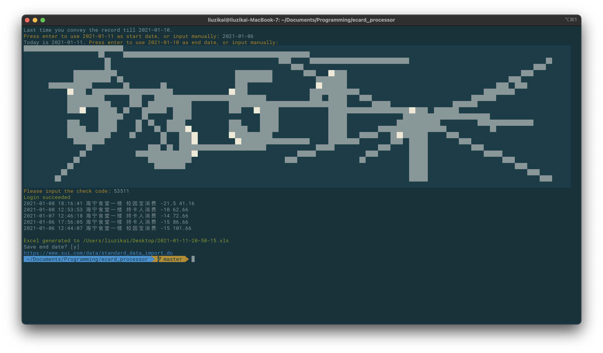

Unofficial Python API to fetch transaction history from ZJU ecardhall (ecardhall.zju.edu.cn).



## Disclaimer

This API is not official. Use at your own risk. [MIT License](LICENSE).

## Files
* ecard_interface.py: the API module
* ecard_processor.py and excel_generate.py: a demo program to fetch transaction history and convert to [sui.com](www.sui.com) import excel file.

## Basic Usage

```python
from ecard_interface import ECardInterface

ecard = ECardInterface()

ecard_account = "000000"
ecard_secret = "000000"
begin_date = "2020-01-01"
end_date = "2020-01-31"

while True:
    ecard.display_checkcode(ecard.get_checkcode())
    checkcode = input(colored("Please input the check code: ", "yellow"))
    if len(checkcode) == 5 and checkcode.isdecimal():
        if ecard.login(ecard_account, ecard_secret, checkcode):
            cprint("Login succeeded", "green")
            break
        else:
            cprint("Error checkcode. CheckCode refreshed.", "yellow")
    else:
        cprint("Invalid Value. CheckCode refreshed.", "yellow")

records = ecard.acquire_data(ecard_account, begin_date, end_date)
print(records)
```

## ecard_processor.py Configuration

Fill your ZJU ecard number and password in config.ini.

```
[Settings]
# The path to store output xls file
workbook_path = .
# Your ZJU ecard account (6 digit)
ecard_account = 000000
# Your ZJU ecard secret (6 digit?)
ecard_secret = 000000
```

You may delete the `History` section. The program will ask for start date.